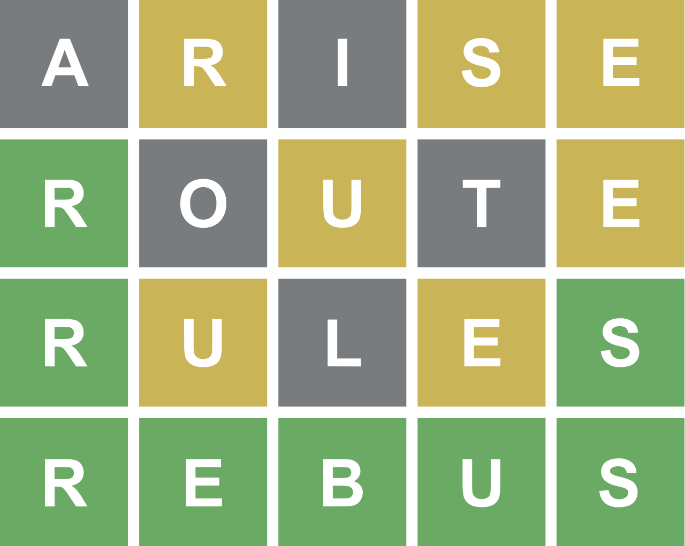
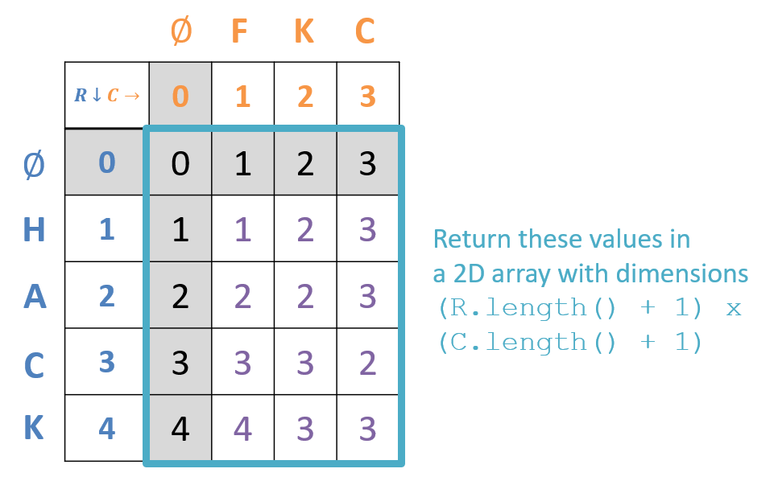
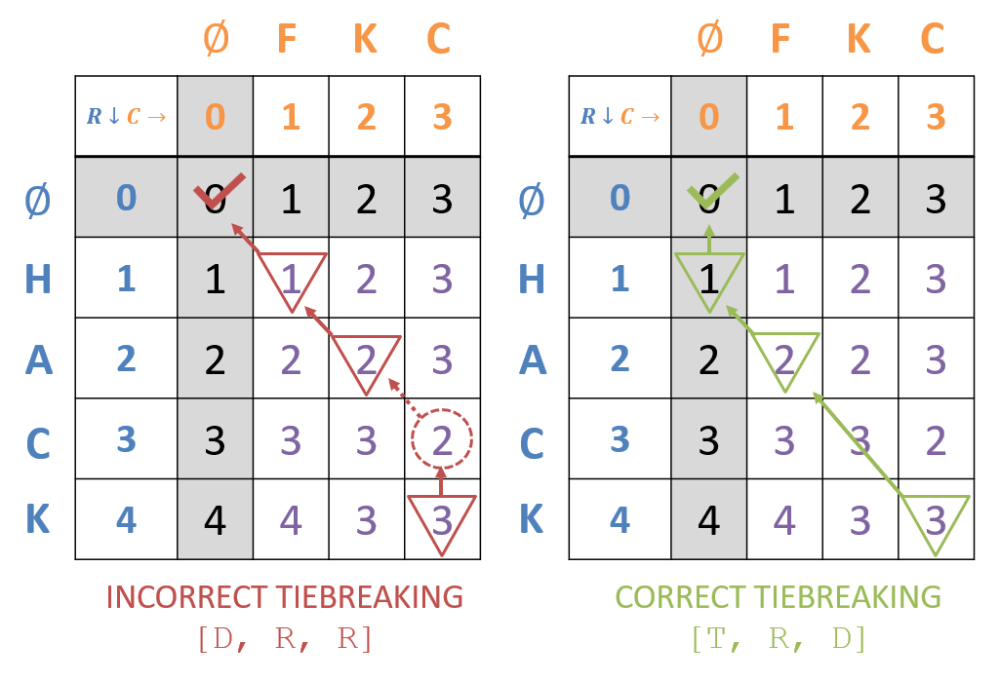

[](https://classroom.github.com/a/JpUATPFz)
# CMSI 2130 - Homework 3

Andrew Winter

<!-- word.png -->


## Assignment Description
Wordle is a popular word puzzle game that challenges players to guess a secret word within a limited number of guesses.
In summary:
1. There's some secret 5-letter word that the player must guess from a known dictionary of words.
1. The player has 6 guesses to figure it out, and with each guess, they get the following pieces of information:
    - Letters of the guess that are NOT in the secret word appear in gray.
    - Letters of the guess that ARE in the secret word, but not in the right position, appear in orange.
    - Letters of the guess that are BOTH in the secret word and in its proper position appear in green.

In this assignment, we'll implement a new version of this game called *Distle*:
- Whereas Wordle's bank of possible answers is only around ~2500 words, the "full" version of Distle has over 100,000.
- Whereas Wordle's answers are always 5 letters long, Distle's can be anywhere from 2 - 14 letters long (depending on difficulty, read on).
- Instead of giving hints in terms of which letters of guesses are contained in the answer and whether or not they're in the correct position, Distle gives the player two pieces of feedback:
    1. The edit distance from a guess to the secret word.
    2. A top-down list of transformations that could be used to turn the guess into the secret word.

See the following example:
```
  =================================
  =       Welcome to Distle       =
  =================================
  [G] Guess 1 / 10
    > oversuspicious
    [~] Not quite, here are some hints:
      [!] Edit Distance: 12
      [!] Transforms (top-down): [R, R, D, R, D, D, D, D, D, D, D, D]
  [G] Guess 2 / 10
    > times
    [~] Not quite, here are some hints:
      [!] Edit Distance: 4
      [!] Transforms (top-down): [R, R, T, R]
  [G] Guess 3 / 10
    > smith
    [~] Not quite, here are some hints:
      [!] Edit Distance: 2
      [!] Transforms (top-down): [R, R]
  [G] Guess 4 / 10
    > smirk
    [~] Not quite, here are some hints:
      [!] Edit Distance: 2
      [!] Transforms (top-down): [R, R]
  [G] Guess 5 / 10
    > smile
  [W] You guessed correctly, congratulations!
  =================================
  = Won: 1 / 1
  =================================
```

### Your Task
You have two primary tasks for this assignment:
1. **Computing Edit Distance** between a guess and the correct word will be a feature of the main game program that you must implement! From this computation, you'll also be able to generate the list of transformations for each guess demonstrated above.
2. **Creating a Distle Playing Agent** that will intelligently play the game, doing its best to derive the correct answer from a given dictionary in some maximum number of guesses.

In the following sections, we will state our assumptions about the problem, and then discuss what you will need to accomplish your goals above.

#### Simplifications and Inputs
In this assignment, we will make the following assumptions about the dictionaries and methods used to process them:
- Words in any of the dictionaries on which the game is played will all be lowercase and without punctuation or numbers.
- There are 3 dictionaries included with the skeleton and in the unit tests, which compose the set of "known" words on which your agent is expected to be able to make guesses:
- ```dictionary6.txt``` contains 27,190 words of length 2 - 6.
- ```dictionary10.txt``` contains 101,009 words of length 2 - 10.
- ```dictionary14.txt``` contains 112,424 words of length 2 - 14.
- ```dictionary6.txt``` will be the smallest dictionary on which your agent will be tested and dictionary14.txt the largest.
- Surprisingly, despite ```dictionary6``` having fewer words, it's actually the hardest to solve, and ```dictionary14``` is the easiest! We'll see why in a bit.

With these details in place, let's look at the precise specifications.

### Solution Skeleton
The code provided in this repository includes the following skeleton code:

#### Part 1: Edit Distances
- ```edit_distance_utils.py``` contains the utility methods needed for computing edit distance and associated string transforms.
- ```edit_distance_util_tests.py``` contains some validating unit tests for your edit distance utilities. This contains the full set of grading tests to make sure you're ready to go for the actual Distle Game that follows.

#### Part 2: Distle Game and Player
This portion will provide the supporting tools that are used BOTH by the Distle Game itself, AND can be used by your DistlePlayer:
- ```distle_game.py```, containing all of the logic for carrying out a game of Distle. You must, and need not, modify any part of this file.
- ```distle_player.py```, containing your agent's logic that will play the game of Distle! You have a lot of freedom to play with different strategies here.
- ```distle_tests.py```, containing some sample unit tests that will be used to grade your submission (per usual, may be incomplete).

> Warning: to speed things up, the tests are run in parallel using the ```joblib``` library; make sure to ```pip install joblib``` or ```pip3 install joblib``` (depending on your path) before running.

- ```distle_game_show.py```, where the magic happens: allows you to play a game of Distle yourself or using your agent! It has a variety of constants that may be set to customize the experience:
- ```MAX_GUESSES``` sets the maximum number of guesses that the player will receive before losing in each game.
- ```N_GAMES``` sets the number of games, in sequence, that the player will player. Useful for testing different agents to see how they do on a large number of games!
- ```WORD``` if set to a String, will be the "secret word" in each game that the player players. If left as null, a random secret word will be selected at each game from the dictionary.
- ```VERBOSE``` boolean flag that can be set to true to see the steps taken by your agent at each decision, false to hide these.
- ```AI_PLAYER``` set to false to play the game yourself in the terminal (prepare to lose) or true to use your DistlePlayer implementation.
- ```DICTIONARY_PATH``` to select the dictionary to play with. You may wish to construct a tiny dictionary with just a few words for test purposes.


### Specifications
#### ```edit_distance_utils.py``` Specifications

```EditDistanceUtils``` contains any distance-based methods you may wish to use in your ```DistlePlayer```, but several of which *MUST* be defined for the base game:

```python
  """
  Variety of functions related to computing the edit distance between
  strings and, importantly, which WILL be used by the DistleGame to
  provide feedback to the DistlePlayer during a game of Distle.
  
  [!] Feel free to use any of these methods as needed in your DistlePlayer.
  
  [!] Feel free to ADD any methods you see fit for use by your DistlePlayer,
  e.g., some form of entropy computation.
  """
  
  def get_edit_dist_table(row_str: str, col_str: str) -> list[list[int]]:
      """
      Returns the completed Edit Distance memoization structure: a 2D list
      of ints representing the number of string manupulations required to
      minimally turn each subproblem's string into the other.
      
      Parameters:
          row_str (str):
              The string located along the table's rows
          col_str (col):
              The string located along the table's columns
      
      Returns:
          list[list[int]]:
              Completed memoization table for the computation of the
              edit_distance(row_str, col_str)
      """
  
  def edit_distance(s0: str, s1: str) -> int:
      """
      Returns the edit distance between two given strings, defined as an
      int that counts the number of primitive string manipulations (i.e.,
      Insertions, Deletions, Replacements, and Transpositions) minimally
      required to turn one string into the other.
      
      [!] Given as part of the skeleton, no need to modify
      
      Parameters:
          s0, s1 (str):
              The strings to compute the edit distance between
      
      Returns:
          int:
              The minimal number of string manipulations
      """
```

ALL of your edit distance utilities rely on getting the edit distance memoization table correct, which returns the completed memoization table for the edit distance problem of turning ```row_str``` into ```col_str```.

Recall that the edit distance is defined as the minimal number of insertions, deletions, replacements, and transpositions required to turn one string into another (see the lecture notes for more details).

>  Note that when you see "recurrence" in the context of dynamic programming, you should know that this means the "recipe" for completing the memoization structure, which can be accomplished either top-down or bottom-up (though you should use the bottom-up approach in this context since every cell is generally required)!

Assume both Strings are all-lowercase and have no special characters or numbers.

Once your table is complete, we'll use that in support of understanding the list of string transformations that were used to turn one into another.

```python
  def get_transformation_list(s0: str, s1: str) -> list[str]:
      """
      Returns one possible sequence of transformations that turns String s0
      into s1. The list is in top-down order (i.e., starting from the largest
      subproblem in the memoization structure) and consists of Strings representing
      the String manipulations of:
          1. "R" = Replacement
          2. "T" = Transposition
          3. "I" = Insertion
          4. "D" = Deletion
      In case of multiple minimal edit distance sequences, returns a list with
      ties in manipulations broken by the order listed above (i.e., replacements
      preferred over transpositions, which in turn are preferred over insertions, etc.)
      
      [!] Given as part of the skeleton, no need to modify -- uses your implementation
      of get_transformation_list_with_table to operate
      
      Example:
          s0 = "hack"
          s1 = "fkc"
          get_transformation_list(s0, s1) => ["T", "R", "D"]
          get_transformation_list(s1, s0) => ["T", "R", "I"]
      
      Parameters:
          s0, s1 (str):
              Start and destination strings for the transformation
      
      Returns:
          list[str]:
              The sequence of top-down manipulations required to turn s0 into s1
      """
  
  def get_transformation_list_with_table(s0: str, s1: str, table: list[list[int]]) -> list[str]:
      """
      See get_transformation_list documentation.
      
      This method does exactly the same thing as get_transformation_list, except that
      the memoization table is input as a parameter. This version of the method can be
      used to save computational efficiency if the memoization table was pre-computed
      and is being used by multiple methods.
      
      [!] MUST use the already-solved memoization table and must NOT recompute it.
      [!] MUST be implemented recursively (i.e., in top-down fashion)
      """
```

Consider the example we saw in class of turning "hack" into "fkc" and observe the intended results for these two methods.

Starting with the result of ```get_edit_dist_table("hack", "fkc");``` we would return the full table (gutters and all) of:

<!-- edit-dist-return-value.png -->


As for obtaining the list of transformations, this is simply a matter of walking-back our recurrence in the completed table.

>  Beware the tiebreaking order though! In the event of two equally minimal edit distance paths, remember that we prioritize transformations in order of: [R,T,I,D]

For our example above, there are actually several possible transformation paths, but only one that would be considered correct by our tiebreaking order. Depicted:

<!-- edit-dist-tiebreaking.png -->


Notes on the above:
- Recall that we begin the operation of collecting a solution recursively at the largest subproblem solution (bottom-right-most cell).
- Notice that the first tiebreaking decision happens immediately at cell (c,r)=(3,4) in that there are 2 equally minimal manipulations: deletion (c,r)=(3,3) and transposition (c,r)=(1,2) Because transposition has a higher priority in our tiebreaking order, we should choose it over the deletion.
- Important to note in general: even if the left table's solution path is incorrect, be careful about cells like (c,r)=(3,3) which are the special case where the letters in that position match, meaning that there should be NO manipulation collected here, and instead recurse on the cell to its top-left.
- Note in the correct path (right table) that we continue collecting manipulations until we've hit the "true" base case of (c,r)=(0,0). Unlike in LCS, the other gutters still represent String manipulations that must be gathered in the correct answer.
- All of the above is to note that ```get_transformation_list("hack", "fkc", get_edit_dist_table("hack", "fkc")) => ["T", "R", "D"]```
- Note that the results of get_transformation_list are dependent on the order of Strings supplied. E.g., if we swapped our arguments above, we get a different answer: ```get_transformation_list("fkc", "hack", get_edit_dist_table("fkc", "hack")) => ["T", "R", "I"]```

#### ```distle_game.py``` Description
>  You are not allowed to modify distle_game.py, but the following are important steps that it takes in order to successfully implement your DistlePlayer AI!

The steps of a single game of Distle are as follows:
1. The Game selects a random word from its dictionary as the secret answer.
2. The Game initializes the Player by informing it of the dictionary that is being used and the max number of guesses it has to make.
3. The Game then proceeds in rounds of guesses in which:
4. The Player is asked to provide a guess using some strategy and whatever fields are chosen.
5. If the guess is correct, the game ends, otherwise, they are given feedback by your get_edit_dist_table and ```get_transformation_dist``` methods comparing the guess to the correct word.
6. The game ends when the player has exhausted their max number of guesses or they guess correctly.

#### ```distle_player.py``` Specifications
```DistlePlayer``` contains the logic for controlling your own automated Distle player, which requires you to implement several methods that will be called automatically during the course of a game.

>  Note: the DistleGame will provide all information necessary to your DistlePlayer to succeed at the game; you do not ever need to call any DistleGame methods yourself!

The following methods in the ```DistlePlayer``` class are thus structured to be called at each juncture in the agent's decision cycle outlined above. You will implement each to encode your agent's strategy and how it responds to feedback.

```python
  def start_new_game(self, dictionary: set[str], max_guesses: int) -> None:
      """
      Called at the start of every new game of Distle, and parameterized by
      the dictionary composing all possible words that can be used as guesses,
      only ONE of which is the correct Secret word that your agent must
      deduce through repeated guesses and feedback.
      
      [!] Should initialize any attributes that are needed to play the
      game, e.g., by saving a copy of the dictionary, etc.
      
      Parameters:
          dictionary (set[str]):
              The dictionary of words from which the correct answer AND any
              possible guesses must be drawn
          max_guesses (int):
              The maximum number of guesses that are available to the agent
              in this game of Distle
      """
```

The ```dictionary```` that contains all possible secret words and allowable guesses is provided as a parameter, as are the max number of guesses.

The provided ```dictionary``` Set is a clone of the DistleGame's, so feel free to manipulate it all you want!

You should use this method to "wipe clean" all of the fields in your DistlePlayer to prepare for a new game and perform any pre-processing you'd like to do on the given dictionary!


```python
  def make_guess(self) -> str:
      """
      Requests a new guess to be made by the agent in the current game of Distle.
      Uses only the DistlePlayer's attributes that had been originally initialized
      in the start_new_game method.
      
      [!] You will never call this method yourself, it will be called for you by
      the DistleGame that is running.
      
      Returns:
          str:
              The next guessed word from this DistlePlayer
      """
```

Each time this method is called, your agent must provide its next guess for the current game's secret word.

Left intentionally vague for you to think about the best approach here!

```python
  def get_feedback(self, guess: str, edit_distance: int, transforms: list[str]) -> None:
      """
      Called by the DistleGame after the DistlePlayer has made an incorrect guess.
      The feedback furnished is described in the parameters below. Your agent will
      use this feedback in an attempt to rule out as many remaining possible guess
      words as it can, through which it can then make better guesses in make_guess.
      
      [!] You will never call this method yourself, it will be called for you by
      the DistleGame that is running.
      
      Parameters:
          guess (str):
              The last, incorrect guess made by this DistlePlayer
          edit_distance (int):
              The numerical edit distance between the guess your agent made and the
              secret word
          transforms (list[str]):
              The list of top-down transforms needed to turn the guess word into the
              secret word, i.e., the transforms that would be returned by your
              get_transformation_list(guess, secret_word)
      """
```

Called by the DistleGame following each incorrect guess that your agent makes via the makeGuess method, which gives you the opportunity to rule out certain words as impossible to thin the search space for the secret word.

>  Note: this method will only do you any good if your ```get_edit_dist_table``` and ```get_transformation_list``` methods are correct, since the DistleGame will call them to produce these hints!

You can use this method as time to update your fields / any sort of record keeping, and/or to prepare your next guess according to some meaningful heuristics.

### Hints
>  Re-read the hints that are scattered above!

General ```DistlePlayer``` Hints:
- Use all pieces of information available to you to make an intelligent guess. These *may* include:
    - The number of words in the given dictionary, including the min and max length of words contained therein.
    - The edit distance furnished during the feedback phase, as well as the contents and order of the transformation list
    >  Note: DistleGame will always call get_edit_dist_table(guess, secretWord) and get_transformation_list(guess, secretWord) with the player's guess as the first argument, and the secret word as the second (this order can be important)!
    - Your agent's past guesses.
- Think of the feedback phase as an opportunity for filtering parts of the agent's dictionary that are no longer possible words -- like playing Guess Who or Clue!
- Good guesses are not necessarily those that are *close* to the secret word, but instead that are good at ruling out more possible candidates.
- You can watch the following video explaining good strategies in Wordle for inspiration (though don't need to worry about any of their fancy computations like Entropy): [Solving Wordle with Information Theory](https://www.youtube.com/watch?v=v68zYyaEmEA&ab_channel=3Blue1Brown).

#### Order of Operations
1. Review your course notes and make sure you have a solid grasp on how Dynamic Programming and Edit Distance operate. During this review, envision what fields and data structures may be relevant in your solution, paying special attention to what is recorded in each cell of your tabulation, and how to recover the transformation list from a completed table.
2. Complete the EditDistanceUtils methods first, they're needed in the DistleGame and DistlePlayer anyways.
3. Start your DistlePlayer by just making random choices and using the feedback phase to intelligently filter the dictionary -- often, this will be enough for deriving some correct answers.
4. After that, start thinking about how to intelligently make choices to rule out as many possibilities as you can with each guess!

Start early and ask questions! I'm here to help!

### Testing & Grading

Submissions will be assessed on two metrics of success:
1. ```edit_distance_util_tests.py``` including all of the tests (i.e., also the grading tests) used to assess your EditDistanceUtils methods.
2. ```distle_tests.py``` running a mini-batch of 100 DistleGames against your DistlePlayer with 10 guesses per game for each of the 3 dictionaries.

The EditDistanceUtils tests are straightforward and just like you are used to running for your submissions.

However, the DistleTests are a bit funny for the following reasons...
- Even a great agent may not succeed at guessing the word every time, but it *will* maximize its odds of doing so.
- Since words are being chosen at random, I've provided some average benchmarks to aim for in each dictionary's mini-batch:
    - A full-credit agent will win roughly 80% of the time on ```dictionary6.txt```
    - A full-credit agent will win roughly 90% of the time on ```dictionary10.txt```
    - A full-credit agent will win roughly 95% of the time on ```dictionary14.txt```
- During grading, everyone's agents will receive the same words from each dictionary so as to be objective... but *which* words your agent receives will be decided by a random seed.
- Any one set of 100 games may take no longer than 200 seconds to complete before the test suite times out. This is generous and should be plenty of time with carefully chosen data structures and attributes (see distle_tests.py for some exceptions to this rule depending on how many processor cores your computer has to run tests in parallel).
- While you're debugging, it's easier to use the distle_game_show.py to empirically test your code; use distle_tests.py only once you're ready to test out your strategy in-general.

### Submission
You will be submitting your assignments through GitHub Classroom!

In terms of what you may and may not change:
- You MUST NOT modify distle_game AT ALL.
- You MUST NOT *change* the method signatures of any public method mentioned above (e.g., change the parameters of the edit_distance method).
- You MAY ADD any *public or private* methods to edit_distance_utils.py that are used by your DistlePlayer. That said, DistlePlayer may only have private attributes and methods added to it.

To submit this assignment:
- Simply push your final, submission copy to the GitHub Classroom repository associated with your account.
- Place your name at the top of *all* submitted files that you modify (in appropriate docstring commenting fashion) AND in the accompanying README.md file.


