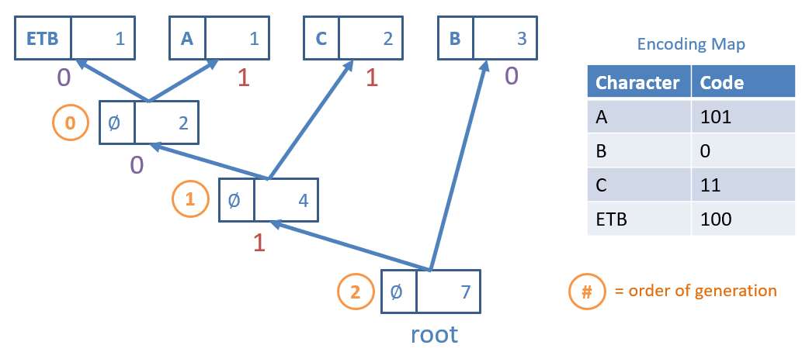
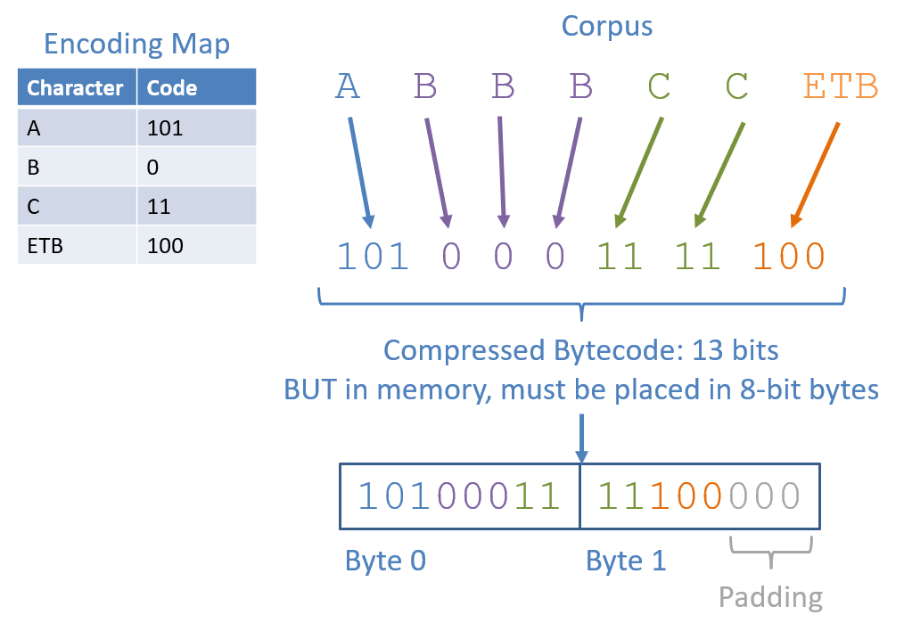

[](https://classroom.github.com/a/ShmYS2-5)
# CMSI 2130 - Homework 4
If at first your tests don't pass, trie trie again

Andrew Winter

---

## Assignment Description
**Implement the Huffman Coding text compression algorithm!** This assignment will give you practice with:

- **Greedy Programming:** Implementing a greedy approach to solve a real-world problem.
- **Huffman Prefix Trees / Tries:** A data structure for modeling prefixes along a path, representing bits of Huffman codes.
- **Compression:** Compressing text to consume fewer bits than its original form.

---

### Problem Specification
**Need a refresher on Huffman Coding?** We are looking for a lossless, prefix-free encoding schema to compress text data.

In this variant, you'll create a **Reusable Huffman Encoder / Decoder** that builds the Huffman Trie once and reuses it to compress and decompress texts of a similar character distribution.

Although less general than an arbitrary Huffman Encoder, the ability to create instances of our reusable variant saves the effort of having to reconstruct or transmit the Huffman Trie every time a new message is compressed or decompressed.

These two primary operations proceed as follows:
1. **Compression:** finding the distribution of characters in the corpus, using these frequencies to find the Huffman Trie, after which we construct the Encoding Map that performs the compression.
2. **Decompression:** given some bitstring (in this assignment, some sequence of bytes each 8 bits in length), decode the original corpus using a Huffman Trie.

---

### Simplifying Assumptions
- Before we detail the nitty-gritty, we should take a second to discuss some of the simplifying assumptions that we'll make regarding your deliverable (since this is an assignment, not a thesis!):
- Decompressed text corpi will be ```Strings``` and their compressed format will simply be stored as Python ```bytes```. In general, you could write these byte to some file, but for testing purposes, we'll make life easier on ourselves.
- All characters to encode / decode will be in basic ASCII (don't worry about case -- for all intents and purposes, upper and lowercase letters will be considered different letters, and all tests will only include all letters that are upper or lower case but not both).
- Since this Huffman decoder is reusable, there will be no need to pass messages with a header containing the bitstring representation of the Huffman Trie; all interactions (encoding or decoding) with the Huffman instance are assumed to be under the same / similar distribution of characters as in the original corpus on which the instance was constructed (see unit tests for more info).
- Corpi on which the Huffman Trie are constructed can have as few as 0 chars.
- Because we'll be dealing with small corpi, the Huffman Trie nodes will encode counts (integers) for the proportions rather than probabilities (floats, as demonstrated in the notes).

>  **IMPORTANT**: In order to have consistency between our solutions and the tests, we will break ties in frequency during Huffman Trie construction in ascending alphabetic order (or equivalently, by smallest character code first, which will be important in the coming section), just like the classwork. Notably, like in the classwork, non-leaf nodes have tiebreaking precedence equal to the highest-priority (i.e., earliest alphabetical) character in its subtrees.

---

### Implementation Details
Before we examine any specifics, we should handle a foible that hampers us slightly in the programmatic domain, though it didn't come up in the theoretical:
>  In Python, and most languages for that matter, the bytes data type is a sequence of fixed-size, 8-bit numbers, and represent the minimum addressable unit that a machine can read from or write to in memory.

In other words, any time we store information into a byte, that means we must store exactly 8-bits per byte.

Why is this a challenge for our compression pursuit?
Because compressed bitstrings may not always have total length that is a factor of 8.

This presents a couple of issues that we'll need to consider:
- **Byte Overflow:** Since each byte is only 8 bits, encoded characters may "bleed over" into a subsequent byte (e.g., if 7/8 bits of byte 0 have been written-to, and we must then store a character that is 3 bytes, we would use the remaining 1 bit of byte 0 and the first 2 bits of byte 1).
- **End Padding:** There will thus necessarily exist some "padding" of 0s at the end of the final byte when we do not use all of its bits.
- **End of Transmission Block (ETB) Encoding:** In order to separate the part of the stored bitstring that is "content" and that which is "padding", we will use a single, special "End of Transmission Block" (ETB) character (ASCII code decimal 23, hex code 17) to signal when we have reached the end of the compressed corpus.

> **Note**: this is one of a number of ways to signal the end of a compressed transmission / file; we could also store a special part of the header denoting how many characters are stored within. The advantage of this method is that we could send transmissions of compressed corpi in a steady stream rather than in discrete files, but that's out of scope for this class.

> Because we want the ETB character to always have the longest code (it'll only ever appear once per compressed message), it will always be prioritized first (i.e., before A) in the alphabetic-order tie-breaking rule. Luckily, because its character code is 23 (less than A's), you shouldn't need any special logic to implement this.

> In the case that the ETB character is the only one in the corpus, it will (by default) have the compressed bitstring 0.


Let's try a simple example from the unit tests to demonstrate.

> Consider the corpus "ABBBCC" in which we would construct the following Huffman Trie with the ETB character, breaking ties in frequency with the ascending alphabetic order.
<!-- hw4-trie-ex.png -->


Notes on the above:
- The ETB character and A were the first to be popped from the priority queue because they tied at lowest frequency (1) and the ETB character always takes precedence over letters.
- The next parent created between Parent(ETB, A) and C popped the Parent(ETB, A) first because they tied in lowest frequency (2) but the Parent(ETB, A) had the ETB in its subtree, thus breaking the tie.
- The final parent created popped the B first (NB: awarding it the 0 bit) since it had lowest frequency 3, followed by Parent(Parent(ETB, A), C) with frequency 4.
- The encoding map derived from this Trie is shown on the right, which can then be used to compress the corpus.
- The ∅ icon in the non-leaves' character attribute does not necessarily mean that you should put nothing here or None, but that you should choose what goes here to accomplish the above.

> Compress the corpus "ABBBCC" using the Huffman Trie / Encoding Map found above.
<!-- hw4-compressed-ex.png -->


> **Note**: conspicuously absent in the above is the header encoding the Huffman Trie we discussed in class. Again, this particular assignment does not need the header because we're assuming that our Huffman instance has a single Trie on which it is constructed, compresses, and decompresses.


With this new format in mind, let's continue with the exact tasks.

#### Python `bytes`
Because we'll be storing our compressed messages as a sequence of `bytes`, we'll want the most space efficient data type possible--Python's `bytes`!

> The Python `bytes` type stores sequences of 8-bit bytes whose literals are represented in hexadecimal, e.g., `b'\x01'`.

<!-- You can also store sequences of bytes in a similar fashion: b'\x01\x02\xA1', representing a sequence of 3 bytes.

Each byte can be converted into its bitstring equivalent, e.g., the byte b'\xa2' == 10100010.

Bytes can also be itereated over, e.g., using the byte_to_bitstring(b: bytes) -> str method in byte_utils.py, you could do the following to obtain the bitstrings corresponding to bytes:

  x = b'\xa2\x03'
  for b in x:
      print(byte_to_bitstring(b))
      
  # Prints:
  #   10100010
  #   00000011
 See the compression_tests.py attached in the skeleton for more handling of bytes, but worry not -- you don't have to do any sort of conversion, 2s complement, etc. like you might've in CSO! -->

You can also store sequences of bytes in a similar fashion: `b'\x01\x02\xA1'`, representing a sequence of 3 `bytes`.

Each byte can be converted into its bitstring equivalent, e.g., the byte `b'\xa2' == 10100010`.

Bytes can also be iterated over, e.g., using the `byte_to_bitstring(b: bytes) -> str` method in `byte_utils.py`, you could do the following to obtain the bitstrings corresponding to bytes:

```python
x = b'\xa2\x03'
for b in x:
    print(byte_to_bitstring(b))

# Prints:
#   10100010
#   00000011
```

> See the `compression_tests.py` attached in the skeleton for more handling of bytes, but worry not -- you don't have to do any sort of conversion, 2s complement, etc. like you might've in CSO!

### Solution Skeleton
Start with the solution skeleton in-hand! In this project, I've given you the outline for the Huffman problem and some sample unit tests.

Apart from the normal configuration files, included in the above you'll find:

- `byte_utils.py`, containing couple of given methods for converting between bytes and strings that you'll find useful!
- `compression_utils.py`, which is your one-stop-shop workhorse for this assignment. Construction of your Huffman Trie and subsequent encoder / decoder are what you'll implement here.
- `compression_tests.py`, which includes some unit tests to help you validate both implementations.

> **Note**: Although, per usual, you do not *need* to modify these tests, you absolutely *should* to test for edge cases -- some important ones are not provided in the unit tests!

### Specifications
All of your work will be completed within the `compression_utils.py` module in which TODOs have been left for you to replace!

#### Problem 1 (`__init__`)
> **Construct the Encoding Map**: given some distribution of characters as represented by a corpus at the time of construction, generate the Huffman Trie and corresponding Huffman Encoding Map.

This task will be handled by your constructor

```python
# compression_utils.py
def __init__(self, corpus: str):
    '''
    Constructor for a new ReusableHuffman encoder / decoder that is fit to
    the given text corpus and can then be used to compress and decompress
    messages with a similar distribution of characters.
    
    Parameters:
        corpus (str):
            The text corpus on which to fit the ReusableHuffman instance,
            which will be used to construct the encoding map
    '''
    self._encoding_map: dict[str, str] = dict()
    
    # [!] TODO: complete construction of self._encoding_map by constructing
    # the Huffman Trie -- remember to save its root as an attribute!
```
1. Finds the distribution of characters in the given corpus. Note: during this step, you will manually add the ETB character (see the ETB_CHAR constant at the top of compression_utils.py for what to add), as it will not be provided as a part of the input corpus.
2. Builds the Huffman Trie from this distribution, using the provided HuffmanNode class and setting the self._trie_root attribute to its root for later use.
    -  **NOTE**: Ensure that you understand the alphabetic tie-breaking mechanics described above *LIKE IN THE CLASSWORK* -- we did not care about tiebreaking rules in the lecture (to demonstrate that any of the Huffman Tries that would amount would be equally optimal), but we do now.
    - Think back to some tools from past assignments that might be useful in implementing the tiebreaking mechanism for your HuffmanNodes...
3. Using the Huffman Trie, creates the Encoding Map used to then compress a corpus with the same relative distribution of characters, setting the self._encoding_map attribute to this encoding for later use.

#### Problem 2 (`compress_message`)
> **Task 2 - Implement Compression**: using the Encoding Map derived in the previous task, implement the compress_message method, which, given a String corpus to compress, produces bytes representing the Huffman Coded compressed version as outlined above.

```python
#  compression_utils.py

def compress_message(self, message: str) -> bytes:
    '''
    Compresses the given String message / text corpus into its Huffman-coded
    bitstring, and then converted into a Python bytes type.
    
    [!] Uses the _encoding_map attribute generated during construction.
    
    Parameters:
        message (str):
            String representing the corpus to compress
    
    Returns:
        bytes:
            Bytes storing the compressed corpus with the Huffman coded
            bytecode. Formatted as (1) the compressed message bytes themselves,
            (2) terminated by the ETB_CHAR, and (3) [Optional] padding of 0
            bits to ensure the final byte is 8 bits total.
    
    Example:
        huff_coder = ReusableHuffman("ABBBCC")
        compressed_message = huff_coder.compress_message("ABBBCC")
        # [!] Only first 5 bits of byte 1 are meaningful (rest are padding)
        # byte 0: 1010 0011 (100 = ETB, 101 = 'A', 0 = 'B', 11 = 'C')
        # byte 1: 1110 0000
        solution = bitstrings_to_bytes(['10100011', '11100000'])
        self.assertEqual(solution, compressed_message)
    '''
```
>  See the `byte_utils.py` for methods that may be useful here!

#### Problem 3 (`decompress`)
>  **Task 3 - Implement Decompression**: using the Huffman Trie derived during construction, implement the `decompress` method, which, given a compressed corpus in the form of a `bytes` sequence, reproduces the original String of characters *WITHOUT THE TERMINATING ETB CHARACTER*.


```python
# compression_utils.py
def decompress (self, compressed_msg: bytes) -> str:
    '''
    Decompresses the given bytes representing a compressed corpus into their
    original character format.
    
    [!] Should use the Huffman Trie generated during construction.
    
    Parameters:
        compressed_msg (bytes):
            Formatted as (1) the compressed message bytes themselves,
            (2) terminated by the ETB_CHAR, and (3) [Optional] padding of 0
            bits to ensure the final byte is 8 bits total.
    
    Returns:
        str:
            The decompressed message as a string.
    
    Example:
        huff_coder = ReusableHuffman("ABBBCC")
        # byte 0: 1010 0011 (100 = ETB, 101 = 'A', 0 = 'B', 11 = 'C')
        # byte 1: 1110 0000
        # [!] Only first 5 bits of byte 1 are meaningful (rest are padding)
        compressed_msg: bytes = bitstrings_to_bytes(['10100011', '11100000'])
        self.assertEqual("ABBBCC", huff_coder.decompress(compressed_msg))
    '''
```
Notes for implementing this behavior:
- Remember that you have access to the `self._trie_root` (after construction) of the Huffman Trie that compressed the message that you are decompressing (or from a corpus of equivalent frequency).
- Once more, consider tools from the `byte_utils.py` module that might be useful here.

### Hints
Some challenges, tips, and hints to consider:
- You've graduated from data structures! Feel free to use any data structures from the Python collections in pursuit of your task.
- During construction of the Huffman Trie (with the tiebreaking mechanism defined on subtree), you can use the HuffNode class without a ton of modification (hint: think about creative use of the character field for non-leaves).
- For ease of the logic and debugging, try to deal with String representations of the bitstring until you are ready to convert those to bytes for the compression.
- Function getting out-of-hand complicated? Remember to use ample helper methods! Be particularly conscious of repeated code and/or methods that grow too large if you want full style-points.


Additionally, here's a good order of tasks to tackle:
- Review your course notes and the relevant Classwork to make sure you have a solid grasp on how Huffman Coding works.
- Run through some example messages to use Huffman compression / decompression. See the sample unit tests for what to expect.
- Develop incrementally! Don't try to do everything at once. Start with compression, test, and then (and only then!) should you continue into decompression.
- Test thoroughly! You should be sure your solution handles a wide swath of input Strings *that put the tiebreaking mechanism to good test.* This is the most common place people lose points on this assignment.
- Start early and ask questions! I'm here to help!

#### Documentation and Style
Practice good style / documentation standards; if you create helper methods or have dense segments of code, make sure to add comments to clearly intimate their use, purpose, and flow.

Fair warning: sloppy coding on this assignment may not lead to code repetition, but will get you lost in your own logic! Use ample helper methods to decompose seemingly big problems into smaller and smaller ones.

For instance, during construction of the output byte array during compression, consider first starting with the desired bitstring, that then can be chunked into bytes by separate helpers.

### Submission
- **What**: Complete the required methods in compression_utils.py that accomplishes the specification above, *in the exact project structure and package given* in the skeleton above. **You must NOT modify any class' *public interface* (i.e., any public class or method signatures) in your submission!**
- **How**: Simply push your final, submission copy to the GitHub Classroom repository associated with your account. Place your name at the top of *all* submitted files (in appropriate commenting fashion) **AND** in the accompanying readme file.