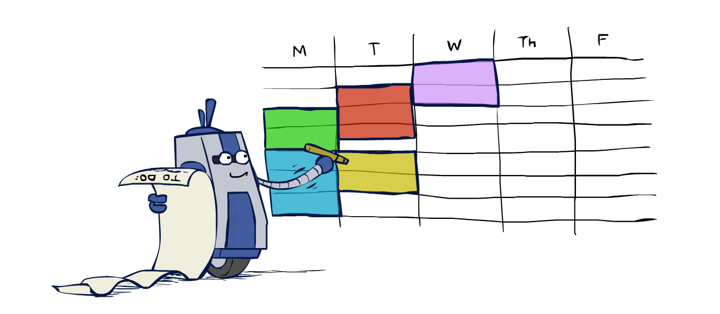

[](https://classroom.github.com/a/muB8BE69)
# CMSI 2130 - Homework 5
Meeting Scheduling: Everyone's Arc Nemesis

Andrew Winter

** PLACE AN X IN ONE BOX BELOW TO INDICATE YOUR EXTRA CREDIT ATTEMPT **

[] I have not attempted the extra credit

[X] I have attempted the extra credit using hillclimbing with simulated annealing

[] I have attempted the extra credit using genetic algorithms with artificial evolution

**Your mission:** Implement a CSP solver for the dreaded task of scheduling meetings!

That's right, we're solving *Calendar Satisfaction Problems* in this one!

If that doesn't excite you, look at this adorably relevant cartoon I found:

<!-- csp-cartoon.png -->

> **_Cartoon credit to Ketrina Yim. Go, little scheduling bot, go!_**

---

## **Objectives**

In this assignment, you will gain practice with the following topics:

- **Backtracking:** Practice implementing a backtracking approach for real-world CSPs.
- **Filtering / Constraint Propagation:** Use preprocessing techniques to reduce work in a CSP solver by filtering variable domains.
- **Date Manipulation:** Use Python's `datetime` library to process date representations.

## **Overview**

### **Task Summary**

You must schedule `n` meetings within an allowable date range. Each meeting is indexed starting at 0 and may have constraints (e.g., must occur before a certain date or not conflict with another meeting).

**A solution** to this CSP assigns dates to each meeting such that all constraints are satisfied. To accomplish this, implement the following tools:

- **Backtracking:** Implement the backtracking algorithm to manage variables, domains, and ordering within the recursion tree.
- **Node Consistency:** perform node-consistency preprocessing to reduce domain cardinality and improve the performance of backtracking.
- **Arc Consistency:** perform arc-consistency preprocessing to reduce domain cardinality and improve the performance of backtracking.


---

## **Example Problem and Solution**

In these problems, you'll encounter:

- **Unary Constraints:** Domain restrictions on a single variable, formatted as `L_VAL OP DATE` where `L_VAL` is some variable index, `OP` is some logical comparator in the set <,>,<=,>=,==,!=, and `DATE` is a... well... date!
- **Binary Constraints:** Domain restrictions between two variables, formatted as `L_VAL OP R_VAL` with both  `L_VAL0` and `R_VAL` as variable indexes.

### Example
Consider an example with three meetings (indexed 0,1,2) in a date range from `2023-1-1` to `2023-1-3`:

```plaintext
Calendar Satisfaction Problem Pseudocode:
  X = {0, 1, 2}
  D_i = {2023-1-1, 2023-1-2, 2023-1-3}
  C = {
      // Unary Constraints:
      0 != 2023-1-2    // "Meeting 0 cannot occur on Jan. 2nd"
      2 < 2023-1-3     // "Meeting 2 must occur before Jan. 3rd"

      // Binary Constraints:
      0 != 1           // "Meetings 0 and 1 must be on separate days"
      1 == 2           // "Meetings 1 and 2 must be on the same day"
  }

  // Possible Solution:
  [2023-1-1, 2023-1-2, 2023-1-2]
  // Meeting 0 on 2023-1-1
  // Meeting 1 on 2023-1-2
  // Meeting 2 on 2023-1-2
```

---

## **Implementation Details**

### **Simplifications and Assumptions**

We will encode **only Unary and Binary constraints** for this assignment. Solutions must process within ~8 seconds for any grading-CSP posed (smaller than the sample unit tests). Arbitrarily large problems may require more than that, but you can expect to be tested on problems larger, but not obscenely larger, to those given in the sample unit tests.

Python's `datetime` library will be used for dates for this assignment:

```python
# Constructing new datetime objects:
from datetime import datetime, timedelta

dt = datetime(2023, 1, 1)
# Comparing datetimes:
dt < datetime(2023, 1, 3)  # => True
# Adding time:
dt + timedelta(days=1)  # => datetime(2023, 1, 2)
```

### **Solution Skeleton**

The provided files:

- **`csp_solver.py`:** Implements backtracking and consistency checking.
- **`date_constraints.py`:** Encodes date constraints on meeting times. **You may not modify these files, but should familiarize yourself with the methods they make available to you.**
- **`csp_tests.py`:** Unit tests to validate your implementation  (you do not need to alter this file for this assignment, but, per usual, *probably should* to give yourself more confidence that your submission works for general formulations [read: the grading tests]).

> There is also an optional **bonus** in this assignment:

- **`csp_local_solver.py`:** A local search CSP solver, and can be aided by the filtering methods you developed in your `csp_solver.py`.
- **`csp_local_tests.py`:** Tests for the bonus extra-credit component.

---

## **Skeleton Overview**

Here's an outline for how we'll end up implementing the above:
1. Understand key parts of the given skeleton that you'll use in your implementation.
2. Implement your Backtracking CSP solver.
3. Implement Node Consistency Filtering.
4. Implement Arc Consistency Filtering.
5. [BONUS] Implement a Local Search CSP Solver.

Let's start by looking at how to programmatically implement and interface with our constraints, and then head to the solver from there.


### **Problem 1: Understanding Date Constraints**

`date_constraints.py` includes a `DateConstraint` class representing Unary and Binary constraints.

```python
#  date_constraints.py
class DateConstraint:
    """
    DateConstraints represent the conditions on how meetings are scheduled in
    the Calendar Satisfaction Problems (CSPs).

    Attributes:
        L_VAL (int):
            The index corresponding to one of the CSP meetings
        OP (str):
            The comparison operator like "==" or ">"
        R_VAL (int OR datetime):
            Depending on whether or not this DateConstraint is unary or binary,
            represents either the other meeting index or specific date against
            which to compare the given meeting in the L_VAL
        ARITY (int):
            How many variables appear in the DateConstraint: 1 for unary, 2
            for binary
"""
```

To initialize these attributes, we can use the constructor with choice of certain parameters to initialize either a Unary or Binary `DateConstraint`:

```python
# date_constraints.py
  def __init__(self, l_val: int, op: str, r_val: Union[int, datetime]):
      """
      Constructs a new DateConstraint with the given variables/datetime and relational
      operator.
      
      Parameters:
          l_val (int):
              The index of one of the variables being constrained
          op (str):
              The logical operator constraining the variable(s) in this DateConstraint.
              Legal choices for op can be found in DateConstraint._VALID_OPS
          r_val (Union[int, datetime]):
              Either the index of another variable being constrained (making this a
              Binary Date Constraint) or a datetime constraining the l_val (making
              this a Unary Date Constraint)
      
      [Unary Date Constraints]
          Constrain a single meeting by its index where the index is always the
          DateConstraint's L_VAL and the specific datetime is always the R_VAL
          Example:
              "Meeting 0 must occur on 1/3/2023"
              DateConstraint(0, "==", datetime(2023, 1, 3))
      
      [Binary Date Constraints]
          Constrain two meetings by their indexes where both L_VAL and R_VAL are
          meeting indexes
          Example:
              "Meeting 0 must occur sometime before meeting 1"
              DateConstraint(0, "<", 1)
      """
```


### **Problem 2: Implementing the `solve` Method**

A **Calendar Satisfaction Problem** is implemented and solved by the `solve` method, which is tasked with returning a **list of datetimes** that satisfy all of its constraints, where the list's datetimes are indexed by the meeting / variable they are assigned-to.

```python
def solve(n_meetings: int, date_range: set[datetime], constraints: set[DateConstraint]) -> Optional[list[datetime]]:
    """
    When possible, returns a solution to the given CSP based on the need to
    schedule n meetings within the given date range and abiding by the given
    set of DateConstraints.
    - Implemented using the Backtracking exact solution method
    - May return None when the CSP is unsatisfiable
    
    Parameters:
        n_meetings (int):
            The number of meetings that must be scheduled, indexed from 0 to n-1
        date_range (set[datetime]):
            The range of datetimes in which the n meetings must be scheduled; by default,
            these are each separated a day apart, but there's nothing to stop these from
            being meetings scheduled down to the second
            [!] WARNING: AVOID ALIASING -- Remember that each variable must have its
            own domain but what's provided is a single reference to a set of datetimes
        constraints (set[DateConstraint]):
            A set of DateConstraints specifying how the meetings must be scheduled.
            See DateConstraint documentation for different types of DateConstraints
            that might be found, and useful methods for implementing this solver.
    
    Returns:
        Optional[list[datetime]]:
            If a solution to the CSP exists:
                Returns a list of datetimes, one for each of the n_meetings, where the
                datetime at each index corresponds to the meeting of that same index
            If no solution is possible:
                Returns None
    """
```

To see what this looks like, here's our same example from earlier, replicated in its Python equivalent:

```python
def test_csp_backtracking_EX(self) -> None:
    constraints = {
        # Unary Constraints
        DateConstraint(0, "!=", datetime(2023, 1, 2)),
        DateConstraint(2, "<", datetime(2023, 1, 3)),
        
        # Binary Constraints
        DateConstraint(0, "!=", 1),
        DateConstraint(1, "==", 2)
    }
    
    # Date range of 2023-1-1 to 2023-1-3 in which we must schedule 3 meetings,
    # indexed 0, 1, 2
    possible_dates = self.generate_dates(datetime(2023, 1, 1), 3)
    n_meetings = 3
    
    # Call our solver to try and assign meeting dates to each index
    solution = solve(n_meetings, possible_dates, constraints)
    
    # Example Solution:
    # [2023-01-01, 2023-01-02, 2023-01-02]
    #       0           1           2
    # |-------- Meeting Indexes ---------|
    
    self.validate_solution(n_meetings, solution, constraints)
```

### **Problem 3: Task 1 - Backtracking**
> **Task 1 - Implement Backtracking**: given a CSP as specified above, implement a backtracking CSP solver with the following signature.

```python
# csp_solver.py
  def solve(n_meetings: int, date_range: set[datetime], constraints: set[DateConstraint]) -> Optional[list[datetime]]:
      """
      When possible, returns a solution to the given CSP based on the need to
      schedule n meetings within the given date range and abiding by the given
      set of DateConstraints.
        - Implemented using the Backtracking exact solution method
        - May return None when the CSP is unsatisfiable
      
      Parameters:
          n_meetings (int):
              The number of meetings that must be scheduled, indexed from 0 to n-1
          date_range (set[datetime]):
              The range of datetimes in which the n meetings must be scheduled; by default,
              these are each separated a day apart, but there's nothing to stop these from
              being meetings scheduled down to the second
              [!] WARNING: AVOID ALIASING -- Remember that each variable must have its
              own domain but what's provided is a single reference to a set of datetimes
          constraints (set[DateConstraint]):
              A set of DateConstraints specifying how the meetings must be scheduled.
              See DateConstraint documentation for different types of DateConstraints
              that might be found, and useful methods for implementing this solver.
      
      Returns:
          Optional[list[datetime]]:
              If a solution to the CSP exists:
                  Returns a list of datetimes, one for each of the n_meetings, where the
                  datetime at each index corresponds to the meeting of that same index
              If no solution is possible:
                  Returns None
      """
```

The following pseudocode can be helpful in implementing the above!

```plaintext
function backtracking_search (variables, domains, constraints):
    return recursive_backtracker (list(), variables, domains, constraints)

function recursive_backtracker (assignment, variables, domains, constraints):
    # Base case: all done!
    if assignment is complete: return assignment
    
    next_var = select_unassigned_variable(variables)
    for each value in order_domain_values(domains[next_var]):
        add next_var = value to assignment
        if assignment is still consistent with constraints:
            result = recursive_backtracker(assignment, variables, domains, constraints)
            if result is not a failure: return result
        # If we get here, that value from our assignment didn't work out, so remove it
        remove next_var = value from assignment
    
    # If we get here, ALL values in the domain of next_var failed, so backtrack:
    return failure
```

Some notes on the above:
- To explain some of the pseudocode's components in greater detail:
    - `select_unassigned_variable`, `order_domain_values` are methods that might have exploited ordering heuristics like MRV and LCV, though you are not expected to implement those heuristics in this assignment, so any arbitrary choice of variable / value order will suffice here.
        > **Hint**: since meetings are *indexed*, you can simply assign in indexed-order (i.e., meeting 0 first, then 1, then 2, etc.)
    - `failure` is some indication that at least one constraint has been violated, which can simply be represented as None in Python.
- You'll notice that `solve` is a classless method, meaning you are *not* recording any of the state in attributes / global variables! Any state relevant to your solution will need to be passed by parameters alone.
    > **Read**: You should not declare any global variables for your implementation!
- Domains are provided as a list of set of datetimes to manage the domains of each variable, and remember that a solution returned by `solve` will be a list of dates where each date in that list corresponds to the index of the meeting it's assigned to.
- Aaaample helper methods apply here; the pseudocode above gives you a great outline such that anywhere you see something that looks functional, it's probably time to implement that behavior as a helper method!
    > **Caveat**: don't reinvent the wheel! I've given you a lot of helper methods in the provided classes. Make sure you're familiar with all of those before writing a lick of code!

>  You'll find one of the `DateConstraint`'s methods particularly useful for the above...

```python
# date_constraints.py
def is_satisfied_by_assignment(self, assignment: list[datetime]) -> bool:
    """
    Determines whether or not this DateConstraint is satisfied by the given assignment,
    which can either be a full or partial assignment of values to meeting variables,
    by index (e.g., index 1 of assignment would correspond to the datetime assigned to
    meeting 1).
    
    Parameters:
        assignment (list[datetime]):
            The list of assigned datetimes to meetings, by index, e.g.,
            [datetime(2023, 1, 1), datetime(2023, 1, 2)]
    
    Returns:
        True if EITHER:
            - The values assigned to this constraint's variables satisfy it, e.g.
                assignment = [datetime(2023, 1, 1), datetime(2023, 1, 2)]
                constraint = 0 < 1
            - The values of at least one variable in this constraint have not yet
            been assigned, e.g.,
                assignment = [datetime(2023, 1, 1), datetime(2023, 1, 2)]
                constraint = 3 == 1
        False if:
            - The values assigned to this constraint's variables do NOT satisfy it, e.g.,
                assignment = [datetime(2023, 1, 1), datetime(2023, 1, 2)]
                constraint = 1 == 0
    """
```

>  Once ready to test, fire up `pytest -k test_csp_backtracking` and what you'll notice is... you pass MOST of these tests, but several may time out!

...that's because we need to do some filtering! Onwards!


### **Problem 4: Task 2 - Node Consistency**
>  **Task 2 - Implement Node Consistency Preprocessing**: not a whole lot to say here! For any unary constraint, make sure to prune inconsistent values from the domains of variables that are mentioned. You will do so by implementing the following method.

```python
# csp_solver.py
def node_consistency(domains: list[set[datetime]], constraints: set[DateConstraint]) -> None:
    """
    Enforces node consistency for all variables' domains given in the set of domains.
    Meetings' domains' index in each of the provided constraints correspond to their index
    in the list of domains.
    
    [!] Note: Only applies to Unary DateConstraints, i.e., those whose arity() method
    returns 1
    
    Parameters:
        domains (list[set[datetime]]):
            A list of domains where each domain is a set of possible date times to assign
            to each meeting. Each domain in the given list is indexed such that its index
            corresponds to the indexes of meetings mentioned in the given constraints.
        constraints (set[DateConstraint]):
            A set of DateConstraints specifying how the meetings must be scheduled.
            See DateConstraint documentation for different types of DateConstraints
            that might be found, and useful methods for implementing this solver.
            [!] Hint: see a DateConstraint's is_satisfied_by_values
    
    Side Effects:
        Although no values are returned, the values in any pruned domains are changed
        directly within the provided domains parameter
    """
```

 Here's an example from the unit tests.

```python
# csp_tests.py
def test_csp_node_consistency_t1(self) -> None:
    # Saying that meeting 0 must occur before Jan 3rd, 2023...
    constraints = {
        DateConstraint(0, "<", datetime(2023, 1, 3))
    }
    
    # ...but our possible dates span Jan 1st - 5th, 2023
    possible_dates = self.generate_dates(datetime(2023, 1, 1), 5)
    n_meetings = 1
    domains: list[set[datetime]] = [deepcopy(possible_dates) for n in range(n_meetings)]
    
    # As such, after performing node consistency...
    node_consistency(domains, constraints)
    
    # ...we'd expect 3 dates to be pruned: Jan 3rd - Jan 5th, leaving only 2 remaining:
    self.assertEqual(2, len(domains[0]))
    self.assertIn(datetime(2023, 1, 1), domains[0])
    self.assertIn(datetime(2023, 1, 2), domains[0])
```

 The only hint here: note another of DateConstraint's methods here!

```python
# date_constraints.py
def is_satisfied_by_values(self, left_date: datetime, right_date: Optional[datetime] = None) -> bool:
    """
    Determines whether or not this DateConstraint is satisfied by the provided 
    left_date and right_date LITERALS, meaning that the input dates must not 
    be variable indexes.
    
    [!] Essentially ignores the constraint's variable indexes in its L_VAL and R_VAL,
    trusting that the method's caller has faithfully supplied values from these domains.
    
    Parameters:
        left_date (datetime):
            The datetime to insert for this constraint's L_VAL
        right_date (Optional[datetime]):
            If NOT None:
                The datetime to insert for this constraint's R_VAL
            If None:
                For Unary Date Constraints, will use the constraint's R_VAL date,
                but will raise a ValueError if left None for a Binary Date Constraint
    
    Returns:
        True when the L_VAL = left_date and R_VAL = right_date, the constraint is satisfied
        False otherwise
    
    Examples:
        unary_dc  = DateConstraint(2, ">", datetime(2023, 1, 3))
        binary_dc = DateConstraint(0, "<", 1)
        
        unary_dc.is_satisfied_by_values(datetime(2023, 1, 5)) => True
        binary_dc.is_satisfied_by_values(datetime(2023, 1, 5), datetime(2023, 1, 4)) => False
    """
```

> Time to test! See if your nodes are happy with: `pytest -k test_csp_node_consistency`


### **Problem 5: Task 3 - Arc Consistency**
> **Task 3 - Implement AC-3 Preprocessing**: For any binary constraint, prune values from the domains of each variable that will never satisfy the relation by the mechanics of the AC-3 algorithm. You will do so by implementing the following method:

```python
def arc_consistency(domains: list[set[datetime]], constraints: set[DateConstraint]) -> None:
    """
    Enforces arc consistency for all variables' domains given in the set of domains.
    Meetings' domains' index in each of the provided constraints correspond to their index
    in the list of domains.
    
    [!] Note: Only applies to Binary DateConstraints, i.e., those whose arity() method
    returns 2
    
    Parameters:
        domains (list[set[datetime]]):
            A list of domains where each domain is a set of possible date times to assign
            to each meeting. Each domain in the given list is indexed such that its index
            corresponds to the indexes of meetings mentioned in the given constraints.
        constraints (set[DateConstraint]):
            A set of DateConstraints specifying how the meetings must be scheduled.
            See DateConstraint documentation for different types of DateConstraints
            that might be found, and useful methods for implementing this solver.
            [!] Hint: see a DateConstraint's is_satisfied_by_values
    
    Side Effects:
        Although no values are returned, the values in any pruned domains are changed
        directly within the provided domains parameter
    """
```

 Here's an example from the unit tests:

```python
# csp_tests.py
def test_csp_arc_consistency_t1(self) -> None:
    # Meeting 0 must occur before meeting 1
    constraints = {
        DateConstraint(0, "<", 1)
    }
    
    # ...and we have a possible range of dates from Jan 1 - Jan 5
    possible_dates = self.generate_dates(datetime(2023, 1, 1), 5)
    n_meetings = 2
    domains: list[set[datetime]] = [deepcopy(possible_dates) for n in range(n_meetings)]
    
    # So, after running AC-3...
    arc_consistency(domains, constraints)
    
    # ...we should recognize that meeting 0 cannot occur on Jan 5 or else there would
    # no date in the domain of meeting 1 that works... 
    self.assertNotIn(datetime(2023, 1, 5), domains[0])
    # ...and vice versa for meeting 1
    self.assertNotIn(datetime(2023, 1, 1), domains[1])
    self.assertEqual(4, len(domains[0]))
    self.assertEqual(4, len(domains[1]))
```

Notes for implementing this behavior:
- Note that you *do not* have to perform AC-3 *during* the course of backtracking for this assignment -- the preprocessing demands that you only do so before the backtracking process begins.
- Smart helper methods will be the key to success here; refer to the AC-3 pseudocode from the associated lecture to get a gist for what to implement by focusing on the parts of the pseudocode that are written in functional notation -- this generally hints that it's time to write a helper! Here's that pseudocode:

```plaintext
function ac_3 (variables, domains, constraints):
    arc_set = initialize_arcs(constraints)
    while arc_set not empty:
        curr_arc = get any arc from the arc set
        if remove_inconsistent_values(domains, curr_arc):
            for each arc (X -> curr_arc.TAIL) from constraints:
                add (X -> curr_arc.TAIL) to arc_set

function remove_inconsistent_values(domains, curr_arc):
    removed = False
    for each tail_val in domain of curr_arc.TAIL:
        if no head_val satisfies curr_arc.CONSTRAINT:
            remove tail_val from domain of curr_arc.TAIL
            removed = True
    # Return whether or not we pruned anything from TAIL domain, since
    # that will predicate whether or not we re-add neighbors to the arc_set
    return removed
```

To help manage the AC-3 Algorithm, I've provided you with an `Arc` helper class in `csp_solver.py`

```python
class Arc:
    """
    Helper Arc class to be used to organize domains for pruning during the AC-3
    algorithm, organized as (TAIL -> HEAD) Arcs that correspond to a given
    CONSTRAINT.
    
    [!] Although you do not need to, you *may* modify this class however you see
    fit to accomplish the arc_consistency method
    
    Attributes:
        CONSTRAINT (DateConstraint):
            The DateConstraint represented by this arc
        TAIL (int):
            The index of the meeting variable at this arc's tail.
        HEAD (int):
            The index of the meeting variable at this arc's head.
    
    [!] IMPORTANT: By definition, the TAIL = CONSTRAINT.L_VAL and
    HEAD = CONSTRAINT.R_VAL
    """
    
    def __init__(self, constraint: DateConstraint):
        """
        Constructs a new Arc from the given DateConstraint, setting this Arc's
        TAIL to the constraint's L_VAL and its HEAD to the constraint's R_VAL
        
        Parameters:
            constraint (DateConstraint):
                The constraint represented by this Arc
        """
```

Reminders on the above:
- Arcs have a HEAD, TAIL, and CONSTRAINT that they represent where the TAIL of the Arc should correspond to the L_VAL of their CONSTRAINT, and vice versa for the R_VAL and HEAD.
- Remember the above when re-adding neighbors into the arc_set of AC-3!
- To help you keep these in order, note the `DateConstraint`'s `get_reverse()` method!

Ready to test if your AC-3 is cool enough? Try it out with: `pytest -k test_csp_arc_consistency`

### **Problem 6: Integration Testing**
Once implemented, BOTH `node_consistency` and `arc_consistency` preprocessing should be integrated into your `solve` method!
Having successfully completed the picture, you can now spin up the full `pytest csp_tests.py` and those pesky timeouts should be gone!


### **Extra Credit**
> **Warning**: You may ONLY attempt the extra credit component of this assignment if ALL required Tasks in the Specifications above have been implemented successfully!

That said, if all is green above, the Extra Credit component is to re-do `solve` using LOCAL Search by implementing the `local_solve` method in `csp_local_solver.py` using a Local Search strategy that employs: (1) hillclimbing with simulated annealing or (2) a genetic algorithm with artificial evolution.

The bonuses for successfully accomplishing these? A dazzling cache of FORNBUCKS! +$F8 for the Simulated Annealing approach OR +$F12 for the Artificial Evolution approach.


#### **Added Specifications**

>  The specifications for the `local_solve` method are the same as in Task 1 in the specifications above!

```python
def local_solve(n_meetings: int, date_range: set[datetime], constraints: set[DateConstraint]) -> Optional[list[datetime]]:
    """
    When possible, MAY return a solution to the given CSP based on the need to
    schedule n meetings within the given date range and abiding by the given
    set of DateConstraints.
    - Implemented using a Local Search Approximate solution method
    - May return None when the CSP is unsatisfiable or when the solver got unlucky
        and ran out of random restarts to succeed
    
    [!] Two important Constants in this file dictate behavior of the local solver:
    - MAX_STEPS = the number of steps that the solver should take from any one
        random initial state
    - MAX_RESTARTS = the number of random restarts the local solver may take before
        giving up and returning None
    
    [!] If attempting a genetic algorithm, may add any constants to the top of this
        file as deemed necessary
    
    Parameters:
        n_meetings (int):
            The number of meetings that must be scheduled, indexed from 0 to n-1
        date_range (set[datetime]):
            The range of datetimes in which the n meetings must be scheduled; by default,
            these are each separated a day apart, but there's nothing to stop these from
            being meetings scheduled down to the second
            [!] WARNING: AVOID ALIASING -- Remember that each variable must have its
            own domain but what's provided is a single reference to a set of datetimes
        constraints (set[DateConstraint]):
            A set of DateConstraints specifying how the meetings must be scheduled.
            See DateConstraint documentation for different types of DateConstraints
            that might be found, and useful methods for implementing this solver.
    
    Returns:
        Optional[list[datetime]]:
            If a solution to the CSP exists:
                Returns a list of datetimes, one for each of the n_meetings, where the
                datetime at each index corresponds to the meeting of that same index
            If no solution is possible:
                Returns None
            If the MAX_RESTARTS are reached:
                Returns None
    """
```

There are some distinct details you'll want to pay attention to:
- Note that `csp_local_solver.py` imports your primary `csp_solver.py` methods, meaning you can re-use the Filtering algorithms you wrote for Tasks 2 + 3 (or other helpers that you wrote there).
- Note also the presence of some constants at the top of `csp_local_solver.py` that you should use where appropriate in your implementation (and kept at the values I gave). You may add to these, but those given include:
    - `MAX_STEPS`, the number of steps during one hillclimbing w/ simulated annealing start from a random state, or the max number of generations to try in the artificial evolution approach. If your solver tries this many steps during a single attempt without finding a solution, it will then attempt a random restart if any are left (see next bullet).
    - `MAX_RESTARTS`, the number of random restarts the strategy will attempt before giving up and concluding that there is no solution (even if there is and it just got unlucky in those 100 attempts). In hillclimbing this means beginning again with a new random initial state at the start of each attempt, and in artificial evolution, this means beginning again with a new random population.
    - **Your additions**: any constants you'd like to add to the solution may go here as well, including parameters for a cooling schedule in simulated annealing or the generation size in artificial evolution.
- Whatever your approach, it should begin as in the main assignment with Filtering preprocessing using Node and Arc Consistency (again, inherited from `CSPSolver`).
- The rest is up to you! This is more of a "blank page" assignment because it's extra credit -- show me how much you've learned and can apply without careful guidance from the skeleton!

## Hints
Some challenges, tips, and hints to consider:
- This assignment is meant to be the culmination of the programmatic tools, tricks, and tips that we've covered and used throughout the semester, so the skeleton is a bit on the lighter side -- remember you data structures and do your best to develop an organized gameplan from the start!
- Check out the `validate_solution` method in `csp_tests.py` for some inspiration for how you might catch backtracking conditions in your csp_solver.
- Function getting out-of-hand complicated? Remember to use ample helper methods! Be particularly conscious of repeated code.


Additionally, here's a good order of tasks to tackle:
1. Review your course notes and Classwork 6 to make sure you have a solid grasp on how CSPs are defined and solved (though the spec might be published before we've seen CW 6, so you can go over the notes to start!).
1. Not sure where to start? Write down the steps that you want to accomplish in plain English first, then translate to pseudocode comments, then translate to actual code.
1. Develop incrementally! Don't try to do everything at once. Start with backtracking, then move to node consistency, and only then to arc.
1. Test thoroughly! You should be sure your solution handles a wide swath of input CSPs.

Start early and ask questions! I'm here to help!

### Testing & Grading
#### Required Portion Testing & Grading
>  This is a challenging assignment, but you can still get a lot of partial credit if you're unable to finish the whole thing!

- Successfully completing solve will net you ~70% credit.
- Successfully implementing node_consistency will add ~+10% on top of that, with successful arc_consistency the remaining 20%.

You can implement solve independently from the consistency filters (so start with it since it's the largest amount of credit), and node_consistency is pretty short.

Give yourself ample time for AC-3, it's probably the trickiest of the 3!

#### EXTRA CREDIT Testing & Grading
- **Note**: Tests for the extra credit are SEPARATE from the original assignment's and are found in `csp_local_tests.py`.

There are some important differences in this set of tests now that we're in the domain of Local Search:

- Note in the log_outcome test helper, we repeat the same test some number of times to see if it meets some threshold of successes. This is required because, as we know, local search methods are not complete, so even a successful implementation may get unlucky and fail once or twice. Because of this, a local search CSP is said to be passed if it succeeds 8/10 times (for this assignment), though a good implementation shouldn't need more than a single test of grace.
- Note: You must have a separate implementation of hillclimbing or artificial evolution in `csp_local_solver.py` to receive any extra credit; using your backtracking solver or anything resembling the main assignment here will not receive credit, even if some of these tests pass.

> IMPORTANT: If you're attempting the extra credit, make sure to check the appropriate box in the README.md!

### Submission
- **What**: Complete the required methods in `csp_solver.py` (and, for the extra credit, `csp_local_solver.py`) that accomplishes the specification above, *in the exact project structure and package given* in the skeleton above.  You must NOT modify any class' *public interface* (i.e., any public class or method signatures) in your submission! Per usual, feel free to add any private helpers that you find useful.

- **How**: Simply push your final, submission copy to the GitHub Classroom repository associated with your account. Place your name at the top of *all* submitted files (in appropriate commenting fashion) **AND** in the accompanying readme file.